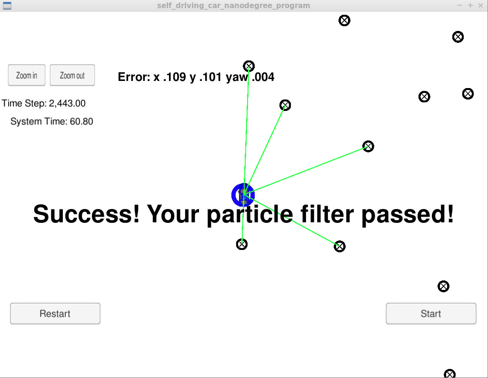

# CarND-particle-filter

## Project Introduction
Your robot has been kidnapped and transported to a new location! Luckily it has a map of this location, a (noisy) GPS estimate of its initial location, and lots of (noisy) sensor and control data.

In this project, a 2 dimensional particle filter in C++ is implemented. The particle filter will be given a map and some initial localization information (analogous to what a GPS would provide). At each time step the filter will also get observation and control data.

## Running the Code
This project involves the Term 2 Simulator which can be downloaded [here](https://github.com/udacity/self-driving-car-sim/releases)

This repository includes two files that can be used to set up and install uWebSocketIO for either Linux or Mac systems. For windows you can use either Docker, VMware, or even Windows 10 Bash on Ubuntu to install uWebSocketIO.

Once the install for uWebSocketIO is complete, the main program can be built and ran by doing the following from the project top directory.

1. mkdir build
2. cd build
3. cmake ..
4. make
5. ./particle_filter

Alternatively some scripts have been included to streamline this process, these can be leveraged by executing the following in the top directory of the project:

1. ./clean.sh
2. ./build.sh
3. ./run.sh

Tips for setting up your environment can be found [here](https://classroom.udacity.com/nanodegrees/nd013/parts/40f38239-66b6-46ec-ae68-03afd8a601c8/modules/0949fca6-b379-42af-a919-ee50aa304e6a/lessons/f758c44c-5e40-4e01-93b5-1a82aa4e044f/concepts/23d376c7-0195-4276-bdf0-e02f1f3c665d)

Note that the programs that need to be written to accomplish the project are src/particle_filter.cpp, and particle_filter.h

The program main.cpp has already been filled out, but feel free to modify it.

Here is the main protocol that main.cpp uses for uWebSocketIO in communicating with the simulator.

INPUT: values provided by the simulator to the c++ program

// sense noisy position data from the simulator

["sense_x"]

["sense_y"]

["sense_theta"]

// get the previous velocity and yaw rate to predict the particle's transitioned state

["previous_velocity"]

["previous_yawrate"]

// receive noisy observation data from the simulator, in a respective list of x/y values

["sense_observations_x"]

["sense_observations_y"]


OUTPUT: values provided by the c++ program to the simulator

// best particle values used for calculating the error evaluation

["best_particle_x"]

["best_particle_y"]

["best_particle_theta"]

//Optional message data used for debugging particle's sensing and associations

// for respective (x,y) sensed positions ID label

["best_particle_associations"]

// for respective (x,y) sensed positions

["best_particle_sense_x"] <= list of sensed x positions

["best_particle_sense_y"] <= list of sensed y positions


# Implementing the Particle Filter
The directory structure of this repository is as follows:

```
root
|   build.sh
|   clean.sh
|   CMakeLists.txt
|   README.md
|   run.sh
|
|___data
|   |   
|   |   map_data.txt
|   
|   
|___src
    |   helper_functions.h
    |   main.cpp
    |   map.h
    |   particle_filter.cpp
    |   particle_filter.h
```


## Inputs to the Particle Filter
You can find the inputs to the particle filter in the `data` directory.

#### The Map*
`map_data.txt` includes the position of landmarks (in meters) on an arbitrary Cartesian coordinate system. Each row has three columns
1. x position
2. y position
3. landmark id

# Implementation Details

The constructor of the Particle Filter class sets up the number of particles, vectors for the particles and the weights. 

The particle filter executes follow steps:

1. Prediction
2. Weight Update
3. Partice Resampling

These steps are implemented in this methods:

```
  void prediction(double delta_t, double std_pos[], double velocity, 
                  double yaw_rate);
```

Predicts the next position of the particles based on the actual velocity and yaw rate. 
Add random noise to the predicted positions. 

```
  void updateWeights(double sensor_range, double std_landmark[], 
                     const std::vector<LandmarkObs> &observations,
                     const Map &map_landmarks);
```

Update the weights for each particle. It uses the observations to compute
the likelihood, which is the new particle weight. 
It transforms the observations to each particle. After the transformations 
the landmarks in sensor range are selected. 
Each observation is associated with a landmark. After these steps 
the new weight is computed by using a multivariate gaussian distribution for
the likelihood.

```
  void resample();
```

Resamples the paricles based on the weights from the previous step. 
To perform the resampling, a discrete_distribution from the C++ std library was used. 
This generates a new particle set based on the weights for the particles. 


# Results

The number of particles is set to 256.
The time for particle filter depends lot on the number of particles.
With 256 particles the required system was 60. I've also executed the
particle filter with 1024 particles. The system time is then between 90 and 100.

Since the higher particle number lead to no improvement with the error, the particle number is fixed with 256.

Finally, the particle filter can locate the robot with a high accuracy.


